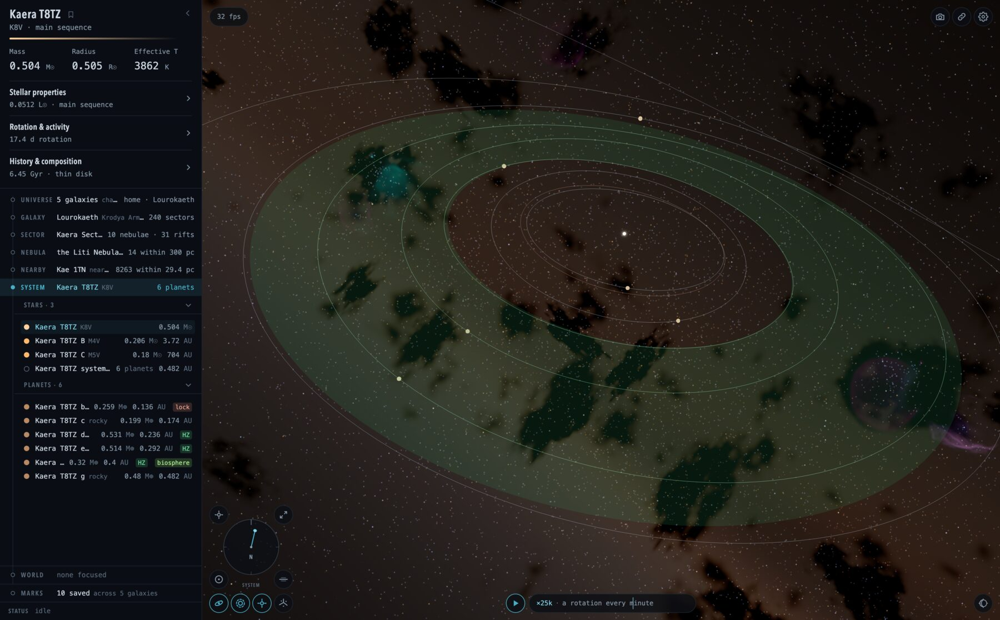
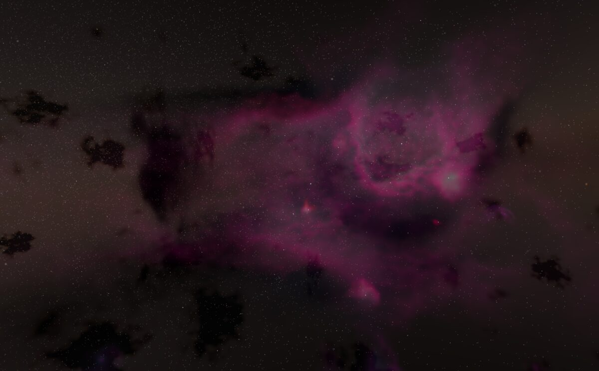
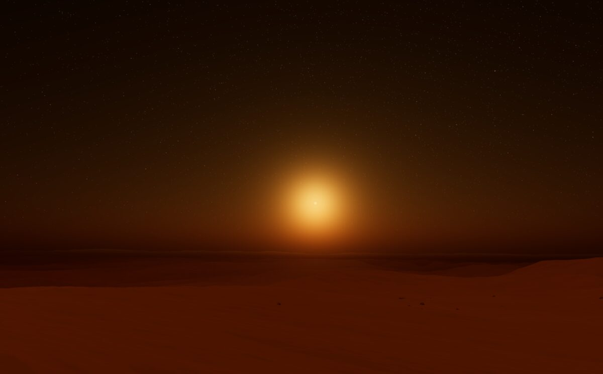
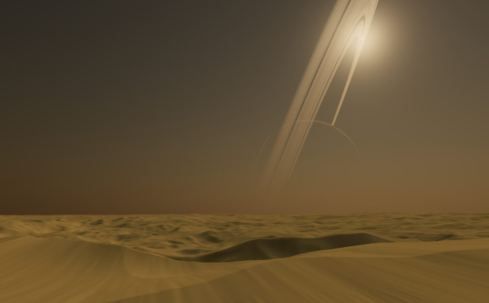
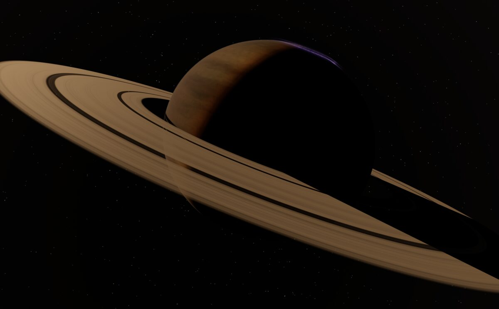

  

  
  
  
  

<a href="https://benphelps.github.io/universe/"><b>Open the app →</b></a>

# Universe

A whole galaxy in a browser tab. Zoom out until the spiral arms come into view, pick any star out of the sky, fly to it, drop into its planets, and land on the ground. No downloads, no loading screens between scales.

## What's out there

- **A galaxy to cross.** Arms, dust lanes, a bright core, and billions of stars. Pull all the way back and it is the same galaxy you were just standing in, seen from outside.
- **A sky you can read.** Every star you can see is a real place with a name, a colour and a distance. Click one and go. Each home system draws its own constellations from its own view.
- **A black hole at the centre.** Its shadow, its ring of light, and the stars behind it bent into arcs.
- **Systems with things happening.** Planets on live orbits, moons throwing eclipse shadows, ringed giants, comets growing tails as they swing in, asteroid belts you can pick a single rock out of.
- **Worlds with weather.** Oceans, ice caps, deserts, river valleys, crater plains. Sunsets look the way that world's air makes them look. Moons rise and set.
- **A camera you can fly.** Skim a valley floor or cross a mountain range in first person.

## Getting around

- **Scroll** to move between scales, from the ground to the whole galaxy.
- **Drag** to orbit, **right-drag** to pan, **click** any glint to travel there.
- **Touch:** pinch to zoom, drag to orbit, double-tap to travel.
- **On the ground:** `W` `A` `S` `D` to fly, `Space` and `C` for altitude, `Shift` to go fast.

Two finders help you find things worth seeing. **Scenic** hunts for photogenic places nearby, from ringed giants to glowing nebulae, and ranks them for you. **Eclipse** finds the next eclipse visible from any surface and drops you there just before it starts, with time paused.

## Sharing a place

The address bar is your location. Copy it and anyone can stand where you stand. The link button beside the shutter goes further: it captures the camera angle and the moment in time, so the reader sees exactly the view you saw.

Everything is generated from seeds, so the same address always leads to the same place. Your first visit asks whether you want the shared galaxy that everyone else explores, or a private one of your own.

## What it runs on

A modern browser with WebGL2. Everything is computed on your machine, so expect the fans to spin, and give it a gigabyte or so of graphics memory.

## The science, briefly

Behind the pictures is a model that tries to get the physics right rather than just the look.

Stars are drawn from measured mass distributions and aged with stellar evolution, so their colours, sizes and lifetimes are what a real star of that mass would have. Planets form from what a system has to build with: material budgets, orbital stability and tidal locking decide what ends up where. Each world's interior, atmosphere and climate are worked out before its surface is drawn, so an ocean, an ice cap or a dune field is a consequence, not a paint job. The sky over a surface scatters its own star's light through its own air, with the right twilight colours and haze. Nebulae, dust lanes and the galaxy's structure all share one underlying cloud model, which is why a dark rift you saw from a planet is the same one you see in the arm from outside.

Generation is deterministic within a model version. When the science improves, older seeds can change on purpose. The [model references](docs/README.md) document every source and every known shortcut.

## For developers

Build, test and contribute: see [DEVELOPMENT.md](DEVELOPMENT.md).
