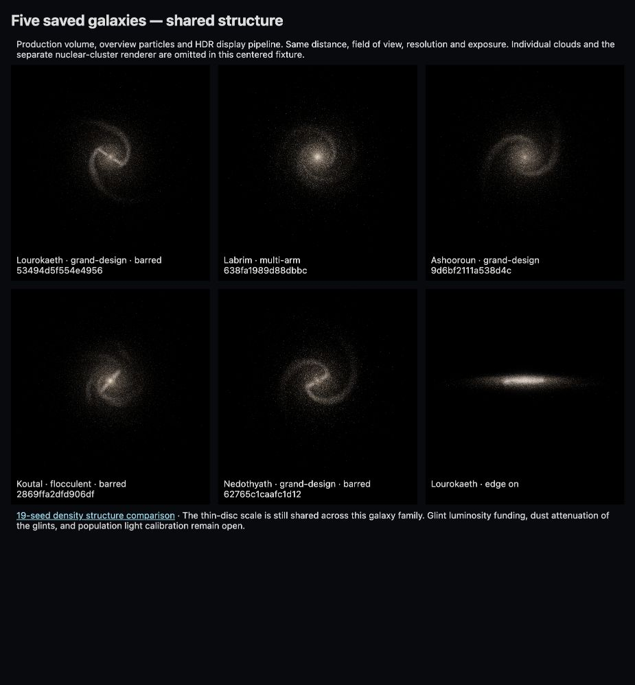

# Galaxies and stars

## Galaxy structure

Galaxy seeds vary arm families, pitch, asymmetry, branches, fragmentation, bars and their relative strengths. Arms modulate an underlying disk population instead of placing every star on a clean spiral curve. Correlated structure appears in both stellar density and dust, with annular normalization preventing a more elaborate arm pattern from silently adding stellar mass. The bulge, disk, halo and nucleus have distinct population and spatial models.

The [Webb spiral-galaxy mosaic](https://esawebb.org/images/weic2403a/) motivates structural diversity. Its infrared dust emission and composite colors are not an optical appearance target. Spiral geometry is informed by observational work such as [Reid et al. (2019)](https://arxiv.org/abs/1908.04246); individual seeds are procedural galaxies, not fitted reconstructions of observed objects.

The stellar halo uses an oblate broken power law with inner/outer slopes 2.3/4.6, a 27 kpc break, flattening 0.6 and a softened 500 pc center. Its normalization is tied to stellar mass (6.9 × 10⁻⁵ solar masses per cubic parsec at 8 kpc), rather than treating mass density as star count. This is a hybrid reference informed by [Deason et al. (2011)](https://arxiv.org/abs/1104.3220) and [Deason et al. (2019)](https://academic.oup.com/mnras/article/490/3/3426/5583060), not a universal observed halo profile.

The implementation lives in [density](../../src/universe/galaxy/density.ts), [spiral structure](../../src/universe/galaxy/spiralStructure.ts), [stellar halo](../../src/universe/galaxy/stellarHalo.ts), and [nuclear population](../../src/universe/galaxy/nuclearPopulation.ts). CPU sampling and GPU projection use shared cached fields. Interpolation agreement, finite densities and mass normalization are tested independently of appearance.

## Stellar populations and evolution

Population age, initial mass, surviving mass, remnants and luminosity are integrated together. Bright display samples do not represent an unweighted draw from the mass distribution. Offline population quadrature provides the moments used by overview and field-star selection, avoiding expensive startup integration.

Stars below the massive-track range use approximate evolutionary phases with fuel-limited clocks. The reference lineage includes [Hurley et al. (2000)](https://arxiv.org/abs/astro-ph/0001295) and the [Kalirai et al. (2008) initial-final mass relation](https://arxiv.org/abs/0706.3894). These prescriptions are not complete isochrones or an interacting-binary calculation.

Massive stars use compressed Geneva tracks at Z = 0.014 and initial rotation v/vcrit = 0.4. Ten published initial masses span 9–120 solar masses; the 8-solar-mass entry is a synthetic bridge. Phase-aware interpolation preserves luminosity, temperature and surviving mass with explicit tolerances. The original extract, provenance, regeneration commands and endpoint limitations are in [reference data](../../data/reference/README.md).

The track compression audit measured maxima of 0.00559 dex in log luminosity, 0.00390 dex in log temperature, and 0.0841% of initial mass in surviving mass. Integrated radiated energy differed by at most 0.0859% from the sampled source tracks. These bound the compression, not the uncertainty of the stellar physics. Evolution outside the table uses bounded prescriptions; metallicity and rotation are not a multidimensional published-track grid.

## Light and dust across scales

Optical power is integrated over 380–780 nm using a blackbody approximation, with spectral hue derived from color-matching functions. Point brightness accounts for pixel footprint and resolution. Resolved stars and diffuse components share population light budgets; the nucleus likewise splits its available luminosity between represented stars and unresolved light. Scene contributions are combined before camera response.

Global extinction includes smooth/statistical distant dust and a disjoint resident-cloud contribution. Near and distant views therefore use compatible density and optical conventions, without promising an exact identical pixel image across every LOD boundary. A finite rendered sample, nonlinear tone mapping and approximate dust integration still affect perceived brightness.

These optical quantities are not calibrated photopic lux or independent astronomical passbands. Infrared imaging needs wavelength-dependent emission, opacity and detector response; recoloring the optical view would be insufficient.

## Validation and limits

Tests cover stellar mass budgets, population moments, sampling determinism, arm bounds, halo normalization, nuclear projection and evolution. The [galaxy-density browser check](../../tools/validation/galaxy-density.html) compares 512 CPU/GPU samples; it allows finite LUT interpolation error rather than requiring bit equality.

Still deferred: observational fitting of each galaxy family, full spectral stellar atmospheres, interacting binaries, broader track coverage, and exhaustive end-to-end flux closure across arbitrary cameras and cloud arrangements. The galaxy is a statistical spatial/population model, not a self-gravitating time evolution.
