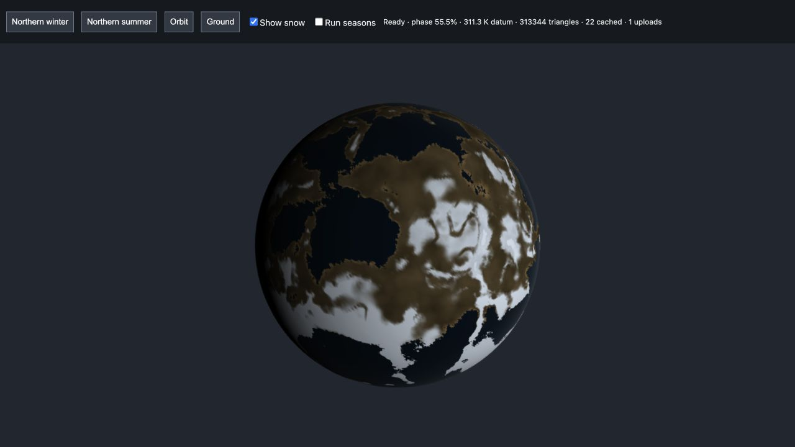
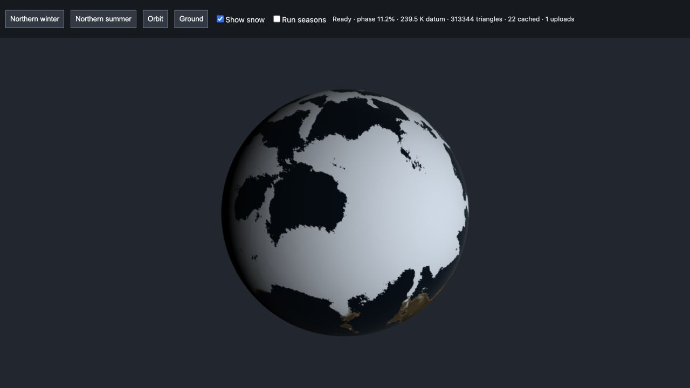
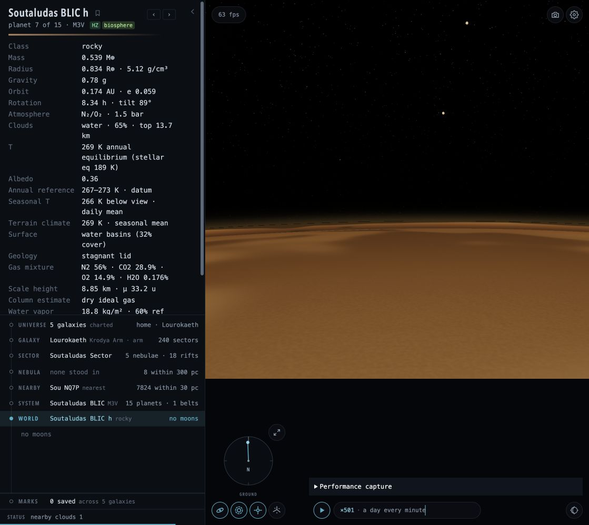
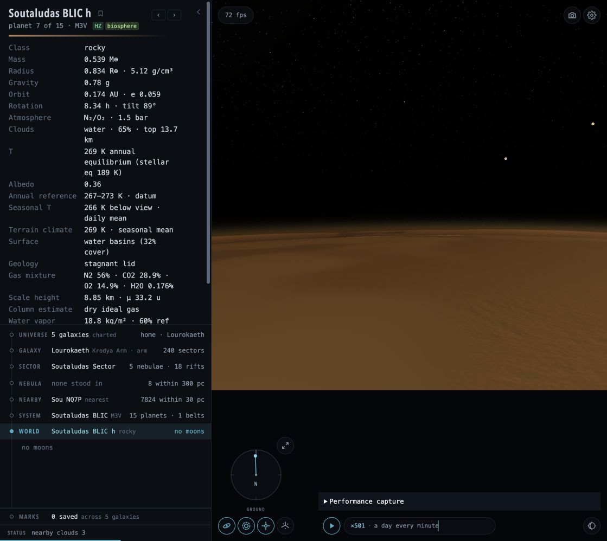

# Worlds, atmospheres and surfaces

## Systems and small bodies

System generation couples stellar properties, a finite disk/material inventory, orbital spacing and stability constraints. Moon survival uses Hill/Roche limits and relevant orbital extrema; mass allocation cannot create an unlimited satellite reservoir. These are procedural formation and stability prescriptions, not long integrations of accretion or N-body dynamics.

Debris belts draw a bounded population from their surviving material budget. Size/rank selection remains consistent as individual rocks resolve. Collision/depletion laws use representative parameters rather than a calibrated dust-cascade calculation; planetesimal mass is not automatically converted into a visible dust disk.

Comets are sparse orbital candidates with visibility/activity dependent on illumination and distance. Sampling mean anomaly avoids placing every candidate near periapsis. Tail and unresolved-body light respond to heating, phase and observer atmosphere. A nebula selection does not create a planetary-system comet. Candidate occurrence and volatile activity remain approximate, not a complete comet population synthesis.

## Climate and atmospheric columns

Stellar forcing, orbital geometry, obliquity, rotation and thermal response feed annual and seasonal climate calculations. Multiple-source illumination is bounded to supported cases. Unsupported forcing/rotation configurations retain a documented annual approximation instead of pretending a seasonal calculation applies.

Atmospheric composition and molecular weights inform an ideal-gas hydrostatic column. A lapse-rate region transitions to a capped isothermal region; CPU queries and GPU transport share the same column parameters. This supports continuous density/pressure and optical depth from orbit to ground. It is a reduced column model, not a full radiative-convective equilibrium calculation, reaction network or weather forecast.

Water inventory constrains humidity and cloud availability. Temperature and pressure guard phase-dependent appearance; frozen basins are not rendered as unlimited liquid oceans. Cloud coverage and structure are prescribed fields with bounded water availability, not a mass-conserving three-dimensional cloud microphysics solver.

Annual insolation is pre-integrated offline; seasonal response is cached over latitude and time. Reference concepts include the [NASA GISS solar forcing data](https://data.giss.nasa.gov/modelE/ar5plots/solar.html) and [climlab seasonal energy-balance examples](https://climlab.readthedocs.io/en/latest/courseware/Seasonal_cycle_and_heat_capacity.html). These inform reduced-model checks, not an observational calibration of generated worlds.

## Reflected light, emitted light and seasonal cover

Terrain, rocks and planetary surfaces combine reflected stellar light and thermal emission in linear space, then apply the common viewing response. Internal heat is apportioned between hot areas and the cooler background rather than assigning an unlimited hot-surface luminosity. Optical thermal emission uses the same 380–780 nm power convention as stellar illumination; cool bodies therefore remain optically dark. See the [Planck-law reference in PBRT](https://www.pbr-book.org/3ed-2018/Light_Sources/Light_Emission).

Seasonal cover changes visible snow/frost on supported rotating, water-bearing worlds using cached temperature response, latitude and terrain height. Ground scatter and terrain sample the same field. Permanent ice, annual terrain classification and ocean geometry are retained; snow does not currently feed back into water mass, albedo-driven climate or latent heat. This is a seasonal appearance layer, not a new coupled climate solver.

These diagnostic images illustrate cover response. The [seasonal preview](../../tools/validation/seasonal-surface.html) uses a controlled reference and generous terrain budget; its triangle count is not a production performance target.

## Terrain and atmosphere rendering

Terrain combines deterministic large-scale structure with progressively resolved detail. Cube-sphere chunks use parent-child morphing and shared height conventions to avoid LOD rings and discontinuities. Horizon/distance culling and bounded caches limit unnecessary geometry. Drainage, erosion-like forms, dunes, craters and vegetation are procedural approximations rather than a time-evolving geological/ecological simulation.

Clouds integrate through the atmospheric column and read opaque scene depth, including reversed-depth conventions. The ground cloud-horizon regression was caused by screen derivatives evaluated on divergent ray paths, producing non-finite lighting. The local volume now uses a stable radial lighting normal and physical fringe; density and foreground occlusion remain volumetric.

## Validation and remaining limits

[Seasonal climate](../../src/universe/planet/seasonalClimate.test.ts), [seasonal surface](../../src/universe/planet/seasonalSurface.test.ts), [atmosphere state](../../src/universe/planet/atmosphereState.test.ts), terrain morph and material tests cover numerical invariants. Browser checks cover actual cloud depth/limb behavior, emitted/reflected light, surface preparation and seasonal appearance; see [validation](../VALIDATION.md).

Future work includes calibrated spectral instruments, coupled radiation/convection and atmospheric chemistry, weather transport, physically coupled snow/water feedback and deeper geological validation. Gas-giant bands/storms remain reduced visual and circulation prescriptions rather than fluid dynamics.
